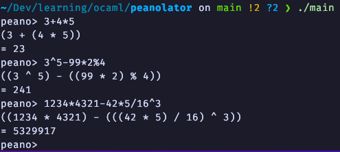

# Peano Calculator and Arithmetic Expression Parser in OCaml

## Introduction

This project is a dive into the world of Peano arithmetic and monadic parser combinators in OCaml. Peano arithmetic is a system of arithmetic based on natural numbers, using only a basic set of axioms. The goal of this project was to implement a Peano arithmetic library and an arithmetic expression parser using OCaml, providing a hands-on learning experience with these concepts.


## Screenshot




## Peano Arithmetic Library

The Peano arithmetic library included in this project performs arithmetic operations using Peano numbers instead of the built-in arithmetic operations in OCaml. Peano numbers are a way to represent natural numbers using only a successor function and zero, without relying on the standard numerical operators. While Peano arithmetic is conceptually elegant and educational, it also implies the use of recursion for arithmetic operations. As a result, performing large calculations can take an exceptionally long time. For example to compute the expression "1000 + 2000" this program will have to make ~5000 recursive calls: 3000 to build the starting Peano numbers and 2000 to perform the addition.

### Tail Recursion

To mitigate the risk of stack overflow when performing recursive calculations, tail recursion has been employed extensively throughout the project. Tail recursion allows recursive functions to be optimized by the compiler, reducing the risk of running into stack size limitations for large computations.

### Memory Usage

While tail call recursion has been employed to optimize performance and mitigate the risk of stack overflow, it's important to consider memory usage when dealing with large Peano numbers. In this project, each Peano number is represented as a recursive data type, where, for instance, the number 5 is expressed as S(S(S(S(S(Z))))). Consequently, performing calculations involving very large numbers can consume a significant amount of RAM to store the numbers and execute the computations. While the use of tail call optimization allows for theoretically unlimited calculations, users should be mindful of memory constraints when working with exceptionally large numbers.

## Arithmetic Expression Parser

Additionally, an arithmetic expression parser was implemented using monadic parser combinators in OCaml. Instead of using a monadic parser combinator library, I decided to implement the library myself. This parser is capable of parsing mathematical expressions, including addition, subtraction, multiplication, division, exponentiation and modulus. The parsed expressions are converted into an abstract syntax tree (AST), which is then evaluated using Peano arithmetic operations to calculate the final result.

## Interface: Read-Eval-Print Loop (REPL)

The interface for this project is a Read-Eval-Print Loop (REPL), allowing users to input mathematical expressions with or without parentheses. The parser follows the correct mathematical precedence rules to parse the expressions accurately. The output of the parser is the result of the Peano arithmetic operations on the given expression, providing a deeper understanding of both Peano arithmetic and OCaml's parser combinators.

## Getting Started

To get started with this project:

- Clone the repo to your local machine:
```bash
git clone git@github.com:zandacw/peanolator.git
```
- Navigate into the project directory:
```bash
cd peanolator
``` 

- Build the REPL and link the expression parser and Peano arithmetic libraries:
```bash
make main
```
- Run the REPL:
```bash
./main
```
## Contributing

Contributions to this project are welcome! If you have ideas for improvements or new features, feel free to open an issue or submit a pull request. Let's collaborate to make this project even better!

## License

This project is licensed under the MIT License. See the `LICENSE` file for details.
